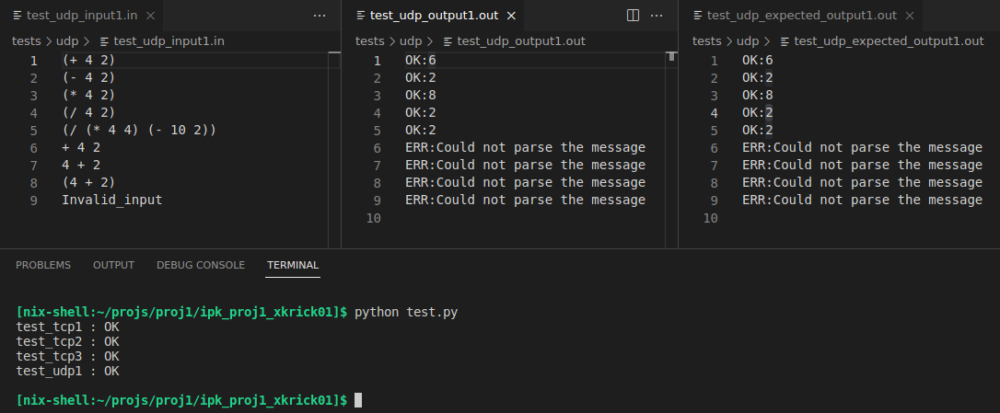

# **Client - Remote calculator**
### Author: `Dalibor Kříčka`
### 2023, Brno

Note: This project was part of the course _Computer Communications and Networks_ at BUT FIT.

---

## **Keywords**
client, server, TCP, UDP, datagram, stream

## **Task Description**
The goal of the project was to implement a client for the [IPK Calculator Protocol](https://git.fit.vutbr.cz/NESFIT/IPK-Projekty/src/branch/master/Project%201/Protocol.md). The client uses TCP mode with a text protocol or UDP mode with a binary protocol for communication with the server. The client reads commands line by line from standard input and then prints the responses received from the server to standard output. The programming language used for the implementation is C++.


## **Usage**
### **Running the client**
The client is started using the following command:

```
ipkcpc -h <host> -p <port> -m <mode>
```

kde:
* **host** is the IPv4 address of the server
* **port** is the server's port
* **mode** is the communication mode with the server – tcp or udp

The program's parameters can be entered in any order.

### **Displaying help**
The help for the program can be displayed in the following way:

```
ipkcpc --help
```

## **Testing**
### **Testing script**
The implementation was tested using a Python script (in the project repository `test.py`) and a set of tests that test various client input cases (in the project repository in the `tests/` folder).

<figure align="center">

<figcaption><b>Img. 2: Testing – Example of testing UDP communication</b></figcaption>
</figure>

---

<figure align="center">

<figcaption><b>Img. 3: Testing – Example of testing TCP communication</b></figcaption>
</figure>

---
### **Terminál**

Another method of testing was typing messages directly into the terminal (e.g., for testing the interrupt signal  _Ctrl-C_).

<figure align="center">

<figcaption><b>Img. 4: Testing – Example of testing from the terminal</b></figcaption>
</figure>

---
### **Wireshark**

Testing whether the client sends and receives messages as expected could be done using the _Wireshark_ program.

<figure align="center">

<figcaption><b>Img. 5: Testing – Example of packet analysis using the Wireshark program</b></figcaption>
</figure>

---

### **Environment**

The program was tested on the following operating systems:
* NixOS
* Fedora
* CentOS/Linux
