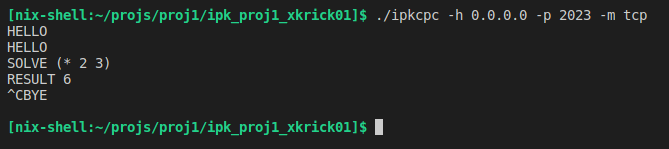

# **Client - Remote calculator**
#### Author: `Dalibor Kříčka`
#### Brno 2023
---

## **Zadání**
Cílem projektu bylo implementovat klienta pro [IPK Calculator Protocol](https://git.fit.vutbr.cz/NESFIT/IPK-Projekty/src/branch/master/Project%201/Protocol.md). Klient využívá pro komunikaci se serverem režim _TCP_ s využitím _textového_ protokolu nebo _UDP_ s využitím _binárního_ protokolu. Klient načítá po řádcích ze standardního vstupu příkazy a na standardní výstup poté tiskne odpovědi přijaté od serveru.
Programovacím jazykem, který je použit pro implementaci, je jazyk _C++_.

## **Použití programu**
### **Spuštění klienta**
Klient je spuštěn použitím příkazu:

```
ipkcpc -h <host> -p <port> -m <režim>
```

kde:
* **host** je IPv4 adresa serveru
* **port** je port serveru
* **režim** je režim komunikace se serverem – _tcp_ nebo _udp_

Jednotlivé parametry programu mohou být zádávány v libovolném pořadí.

### **Vypsání nápovědy**
Následujícím způsobem je možné vypsat nápovědu k programu:

```
ipkcpc --help 
```

## **Teoretická část**
### **Socket**
Způsob abstrakce operačního systému pro aplikační úroveň. Je to koncový bod komunikace mezi dvěma aplikacemi běžících na síti. Zpravidla má tedy server i klient svůj vlastní socket. Server přidělí socketu port a čeká na klienta, který se s ním pokusí spojit. Klient tedy musí při vytváření svého socketu znát nejen IP adresu na které server běží, ale i číslo portu na kterém naslouchá socket serveru.

Typy socketů v rámci projektu dělíme na 2 typy podle režimu komunikace:
* **Datagram (UDP)**
* **Stream (TCP)**

### **TCP**
Zajišťuje spojovaný přenos, což znamená, že komunikuje vždy 1 odesílatel s 1 příjemcem, kteří vždy musí před vzájemnou výměnou dat navázat spojení (tzv. handshake). Další významná vlastnost TCP je spolehlivost, jelikož je zpráva přenášena jako kontinuální proud (Stream) bytů a je tak zachováno pořadí jednotlivých bytů dat.

### **UDP**
Protokol UDP je nespojovaná služba, jelikož před komunikací mezi servrem a klientem nenestavá žadné spojení. Zprávy zasílá ve formě datagramů a negarantuje jejich doručení, proto je to služba označována jako nespolehlivá.

## **Implementace programu**
Projekt byl naimplementován v jazyce _C++_ s využitím následujících knihoven:
* **iostream** – definuje objekty standardního vstupu a výstupu (_cout_, _cin_)
* **string.h** – definuje funkce pro práci s řetězci typu _char *_
* **regex** – definuje funkce pro práci s regulárními výrazy, využito při validaci zadaných argumentů programu
* **sys/socket.h** a **arpa/inet.h** – poskytující funkce, datové struktury a makra pro síťovou komunikaci, využito pro správu socketů, nastavení informací o hostitelském serveru a odesílání a příjímání zpráv od serveru
* **signal.h** – definuje funkce a makra, které umožňují reagovat na systémové signály, využito pro zachycení signálu přerušení (Ctrl-C)
* **unistd.h**

Významné části a celkové chování programu (sekvence jednotlivých kroků) je znázorněno v UML diagramu aktivit (Obr. 1) níže. 

<figure align="center">

<figcaption><b>Obr. 1: UML – Activity diagram</b></figcaption>
</figure>


## **Testování**
### **Testovací skript**
Testování implementace bylo prováděno za pomocí skriptu v jazyce python (v repozitáři projektu pod názvem `test.py`) a sady testů testující různé případy vstupů klienta (v repozitáři projektu ve složce `tests/`).

<figure align="center">

<figcaption><b>Obr. 2: Testování – příklad testování UDP komunikace</b></figcaption>
</figure>

--- 

<figure align="center">

<figcaption><b>Obr. 3: Testování – příklad testování TCP komunikace</b></figcaption>
</figure>

---
### **Terminál**

Dalším způsobem testování bylo psaní zpráv na vstup přímo do terminálu (např. pro testování signálu přerušení _Ctrl-C_).

<figure align="center">

<figcaption><b>Obr. 4: Testování – příklad testování z terminálu</b></figcaption>
</figure>

---
### **Wireshark**

Testovat, zda klient odesílá a přijímá zprávy dle očekávání, se dalo pomocí programu _Wireshark_.

<figure align="center">

<figcaption><b>Obr. 5: Testování – příklad analýzy packetů programu Wireshark</b></figcaption>
</figure>

---

### **Prostředí**

Program byl testován na následujících operačních systémech:
* NixOS
* Fedora
* CentOS/Linux

Na jiných než výše uvedených operačních systémech není zaručena korektní funkcionalita programu (Windows, MacOS, ...) – více viz [CHANGELOG.md](CHANGELOG.md).

## **Seznam použité literatury**


* harleenk_99. Socket in Computer Network. _GeeksforGeeks | A computer science portal for geeks_ [online]. Upravil deepanshukamboj. 22. prosinec 2022 [cit. 2023-3-18]. Dostupné na: [GeeksforGeeks](https://www.geeksforgeeks.org/socket-in-computer-network/)

* Přispěvatelé Wikipedie. Síťový socket. _Wikipedie: Otevřená encyklopedie_ [online]. 9. leden 2023 [cit. 2023-3-18]. Dostupné na: [Wikipedie](https://cs.wikipedia.org/wiki/S%C3%AD%C5%A5ov%C3%BD_socket)

* Oracle. What Is a Socket?. _The Java Tutorials_ [online]. © 1994-2023 [cit. 2023-3-18]. Dostupné na: [The Java Tutorials](https://docs.oracle.com/javase/tutorial/networking/sockets/definition.html)
